# Table of Content
1. [Site Overview](#site-overview)
2. [Planning](#planning)
    * [Target Audiences](#target-audiences)
    * [Color Scheme](#color-scheme)
    * [Wireframes](#wireframes)
3. [Features](#features)
    * [Existing Features](#existing-features)
    * [Future Updates](#future-updates)
4. [Testing](#testing)
    * [Responsiveness](#responsiveness-testing)
    * [Validator Results](#validator-results)
    * [Functionality](#functionality-testing)
    * [User Stories](#the-user-stories)
    * [Bug Report](#bug-report)
5. [Deployment](#deployment)
6. [Credits](#credits)

# Site Overview 

Where to Fish is a website created to allow users to find fishing lakes within a set radius of a chosen location. It will achieve this by accessing the Google Maps API functionality. I also intend to allow users to create an account, which being logged into will trigger responsive changes throughout the site. Rather than using an actual database, I am going to use the devices local storage to mock this. This is not only due to not yet having the required knowledge to use these databases to create user accounts, but also (and more so) due to wanting to use Javascript to achieve all of the desired responsiveness and functionality for my site.

# Planning 

## Target Audiences:

* Users who are new to fishing

* Users who are looking for new fishing lakes

* Users who have experience fishing 

### User Stories:

* As a user I want to understand the sites purpose.

* As a user I want to find fishing lakes around my area.

* As a user I want to be able to update my saved details easily.

## Color Scheme:

When choosing the colors, I wanted the design of my site to mimic the visual experience of going fishing. So I chose a light green and a dark brown color to use as the footer and navbar background, to imitate the brown of dirt and bark, along with the lightgreen of the leaves of a tree or grass in the sunlight. Then I decided on a light blue background for the main body of the page to represent the water of the lake. The only place this styling differs is on the account page. There I chose a dark green color for the main body, to represent the color a bivvy or grass, so the account page gives the user the feeling that this is their hub so to speak, away from the activity.

Below is a grid that I have used to check the contrast scores so as to be sure all text remains readable throughout the site, created on https://contrast-grid.eightshapes.com/ .

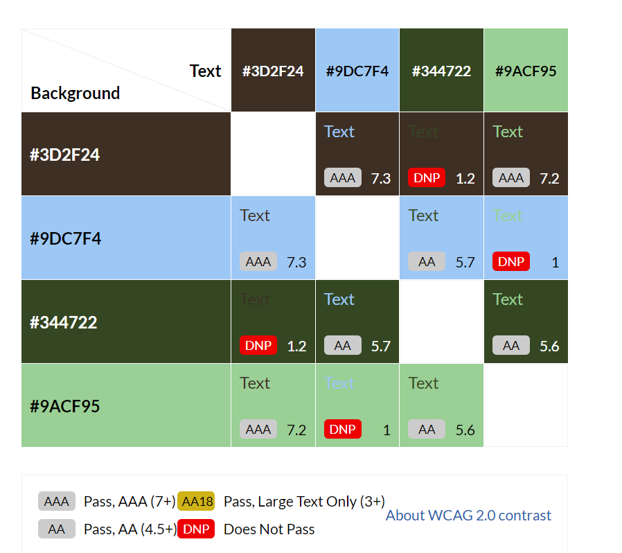

* The only color combinations used are those that pass.

## Wireframes:

Here are my wireframes that I created at the start of my project and used as the rough template for my site, for mobile, tablet and desktop viewing. Below them you will find a list detailing how the design has changed as the development process was going on. More information on why these changes where made will be found below.

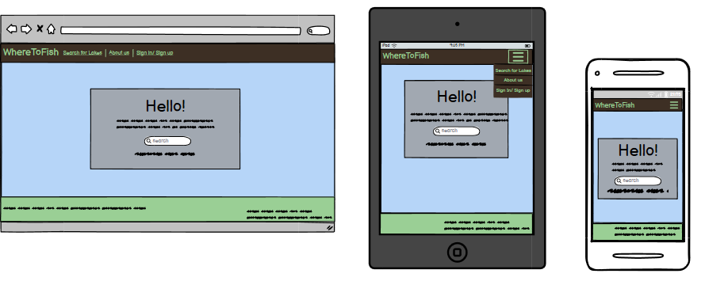

* The only real design changes to the home page are that the search bar found in the jumbotron has been replaced on the working site by a simple button. This was due to time constraints.

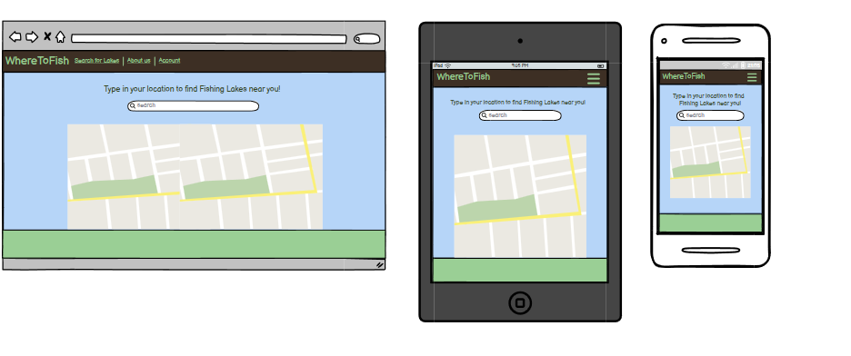

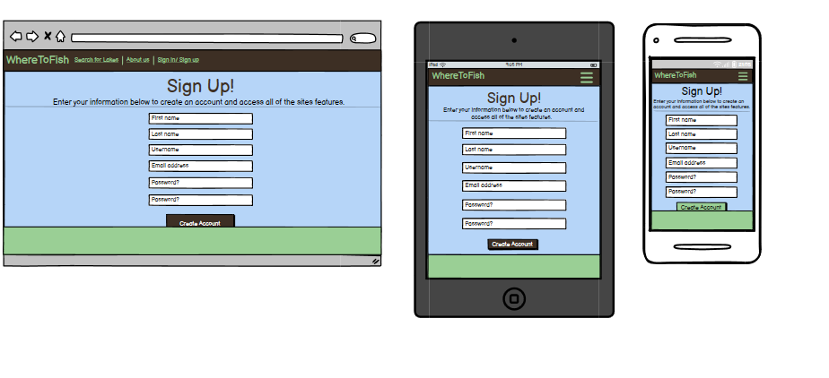

* The sign up form found on the site does not have first and last name fields as they where not required at all at this stage in the sites development. 

* There was no wireframe created for the change details page found through the account page, but the design is almost exactly the same as sign-up.html.

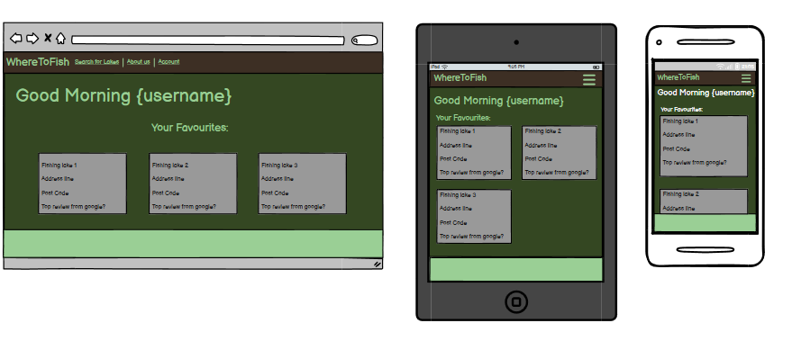

* The design and structure of the account page has remained the same as the wireframe, however the functionality I was planning on adding (see more in the features section below) was scrapped. Therefore at this time other than the interactive welcome message and link to change-details.html, the only content on the page unfortunately is text displayed to inform the user that there is no content to see.

# Features

Below you will find a list of the features currently found on the site, and also a few features I am planning on adding in the future.

## Existing Features:

* The navbar is fully responsive, and respond to the users interaction with the site. When first landing on the site the nav will contain search and sign up link to the respective html pages. After submitting there details in the sign up form, the sign up will be replaced with account.

### Home page:
* The Home page features a button within the jumbotron that has a click event listener attached, upon clicking it the user will be taken straight to search.html. This exists as the pages text content (other than the nav bar) is all found within the jumbotron and therefore I thought it made sense to give the user a way to move through the site where their attention is drawn.

### Search page: 
* Search.html is the main bulk of the sites functionality. I used the Google Maps API and googles documentation to achieve a working map, with a search bar with autofill properties that upon searching a location will navigate the map to the users chosen location and display fishing lakes within 5 miles of the users chosen location. As the javascript for this is nearly entirley from the google docs, just jigsawed together to achieve my end goal, I have placed the code in a seperate script titled index.js. The rest of the javascript code for the site is found in wtf.js.

### Account page:
* For the account page, as mentioned in the wireframe section, the bulk of the planned content for the page had to be scrapped due to time constraints. However I was able to achieve one thing I wanted for this page and that is the welcome message is interactive and will respond to the users input of the sign up or change details forms and display the users chosen username after the 'Welcome'.

### Sign-up and Change-details pages:
* I have put these pages into the same section of this page as they are essentially the exact same page. Change details is Sign up's html and js code copied, pasted and then the html was modified to fit the pages requirements and the js for the sign up page had EmailJS functionality added. So when the user submits the form, they will receive an email to their inputted address confirming the creation of an account. 

## Future Updates:

* I plan on adding much more functionality to account.html. My initial plan was for the site to aloow users to favorite locations and view those favorites on the account page.

* I also intend on adding the search bar onto the home page, allowing users to search a location straight from there.

# Testing

## Responsiveness Testing:

I began testing the responsiveness of the site firstly by switching through different device screen sizes using developer tools on google chrome on each page and using every feature at each main breakpoint. Below you will find a screenshot of the full list of the device screen sizes used.

* List of device screen-sizes used in dev tools:
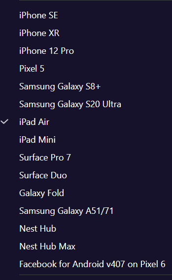

### I have tried to test the website on as many devices as I can, however, I don't have access to many. here I will include a list of all the devices that I have been to use to test the site:
* ASUS Zenbook Duo 14 ^
* Samsung S20 ultra ^
* Samsung A51
* IPhone 14
* IPhone 12
* IPad Air (4th gen) ^

### Here is a list of the different browsers I have tested the website on and found no obvious faults:
* Opera/Opera GX
* Google Chrome
* Microsoft Edge
* Mozilla Firefox
* Samsung Internet (Android)
* Safari 

## Validator results

### JSLint:

* After putting my js into JSLint I am pleased to say there where no major issues, however lots of warning where present. This is due to a failure of the learning materials. For instance I was lead to believe that as long as we where consistent, the use of double quotes and single quotes is interchangeable. This is not the case for JSLint as that was one of three recurring warnings that I was totally unaware that I should have been looking out for, these being lines over 80 characters and spaces between blocks of code, that are there for readability. The only other warning is JSLint claims things such as console in console.log(), or document in document.getElementById() are undefined.

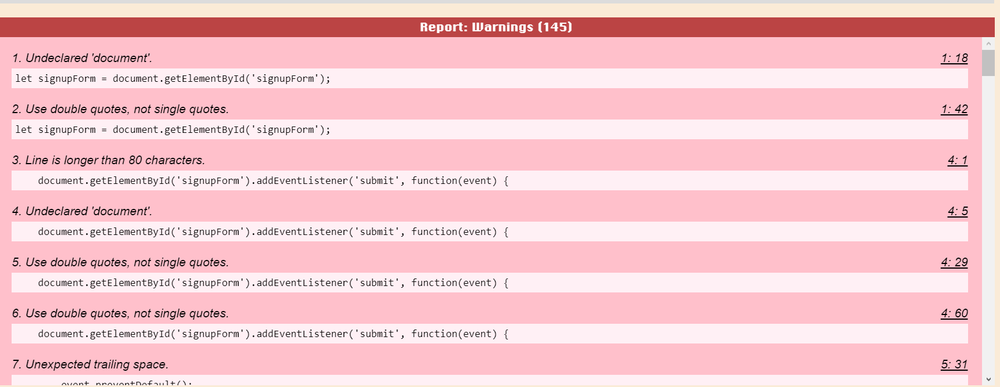

### HTML Validator:

* Home page:
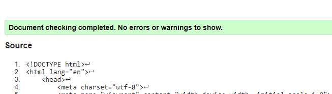

* Search page: 
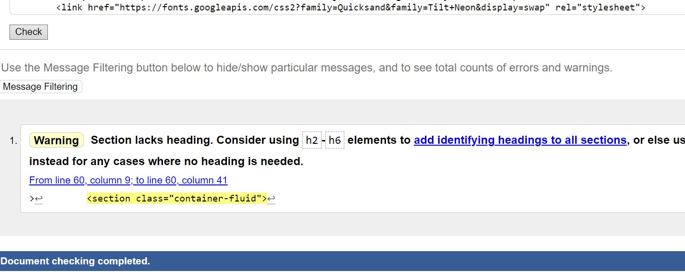
* section without heading is the container for the map div which contains no text (at least no text from the pages html) therefore no heading can be placed.

* Account page:
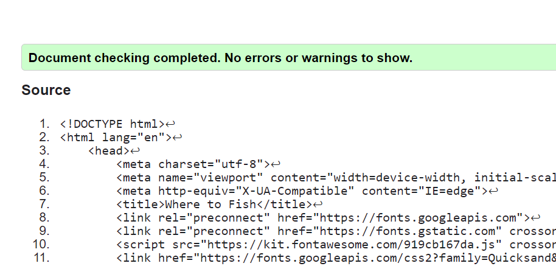

* Sign up page: 
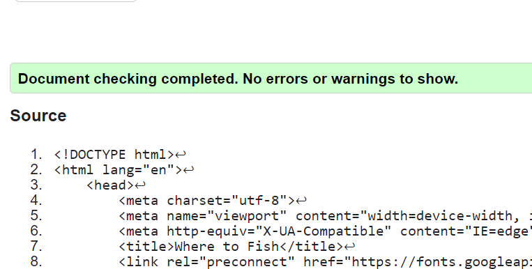

* Change details:

### CSS Validator Results:

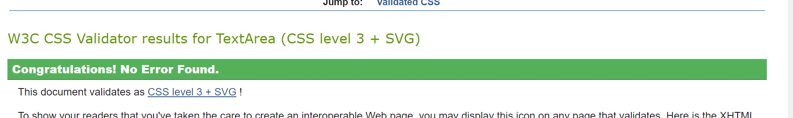

## Functionality Testing:

### Initially I planned on using automatic tests with jest. However I found very little use for it during development and found it too time consuming and dropped it in favor of manual testing throughout development using console logs and the live server.

* I started with testing the navbar across the site going to and from pages and then filling out and submitting the sign up form and checking that the correct changes occured and encountered no errors.

* All html elements where tested and checked using the live server. 

* Due to using code from their library, It was hard to test the maps functionality with anything other than checking and testing on a live server as with the html of the site.

* My javascript functions are callbacks that been wrapped in if statements. This is not only done for testing purposes as the console logs made it much easier to troubleshoot, but was initially done when I had problems with code producing errors when not on the page where which the functionality exists. I found advice to use If statements from stack overflow, meaning that rather than throwing an error when an element is not found on the page, the function will simply console log that the required element does not appear on the site and continues to read the code.

## The User Stories:

* As a user I want to understand the sites purpose.
    * Upon landing on the home page, the user is greeted with a 'jumbotron' in the center of the page which informs the user of the sites purpose and invites them to continue into the site.
    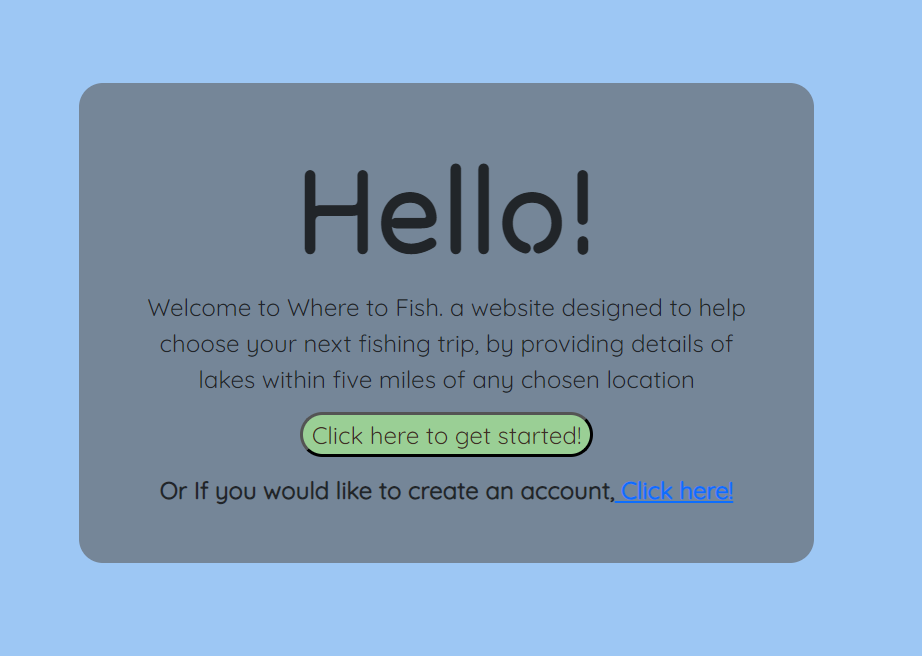

* As a user I want to find fishing lakes around my area.
    * After reading the greeting on the home page, the user clicks on the indicated button which takes them to search.html. There they find the map and search bar with a small bit of text informing the user of what to do next.
    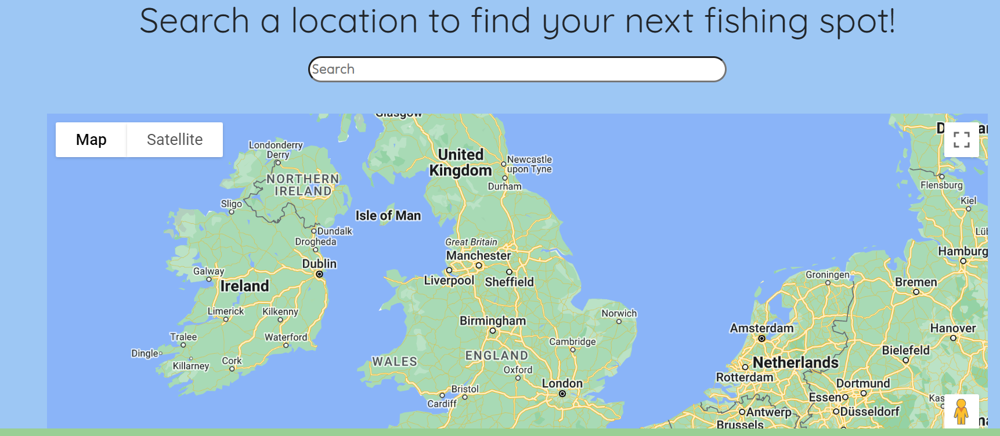
* As a user I want to be able to update my saved details easily.
    When the user inputs their data via the sign up form, they are immediately taken to account.html. At the top of the page they will see text with a link inside, from there they can navigate to change-details.html and are presented with another form. 
    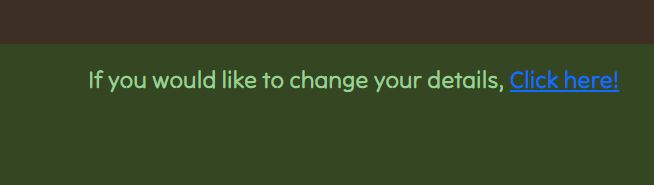

## Bug Report:

* Google
    * I had a lot of issues using the google maps api during development. I'm not able to give to much detail other than there where 500 errors stemming from google library, and even now I have warnings on search.html that are not effecting the functionality and I simply do not know if/how I can fix these issues.

* Submit button
    * When using the site on Firefox, rather than just reading 'submit' the button reads 'submit query' and whilst this is not the intended text, I do not have much issue with it but either way was too pressed for time and did not get round to looking into a fix.

* EmailJS
    * When setting up the emailjs functionality, I encountered a bug where the email would not send (due to it not grabbing the the email variables value from local storage) until the page had refreshed. I looked into the issue and found several articles talking about using promises and in particular the .then() and .catch() to handle these kinds of errors in a similar way that the if statements handle rest of the functions and found that this fixed the issue.

# Deployment

* The site was deployed to GitHub pages. The steps to deploy are as follows:
    * From this project's repository, navigate to the settings tab
    * From the left hand menu, select pages.
    * From the source section drop-down menu, select the Main Branch.
    * Once the main branch has been selected, the page will refresh and provide a link to the live project.

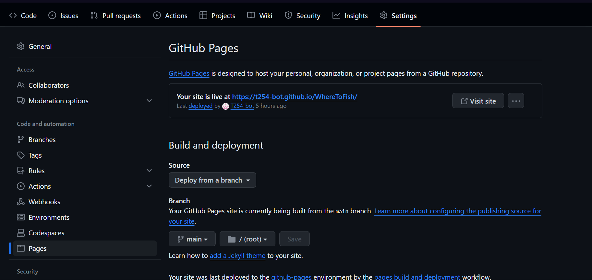
The live link can be found here - https://t254-bot.github.io/WhereToFish/

# Credits

* All google maps functionality is from [google](https://developers.google.com/maps)

* Advice on formatting and error handling my Javascript from Stack overflow, Stack exchange and Medium.com

* Nav template from Bootstrap and Jumbotron (previously in bootstrap) from w3c schools

### And a huge thank you to my mentor rich, who helped me with my confidence during this project aswell as going above and beyond helping me too understand the more complicated parts of the project. And also to my friend Barnaby, who was always there to help me troubleshoot, explain things and to bounce ideas off. 

